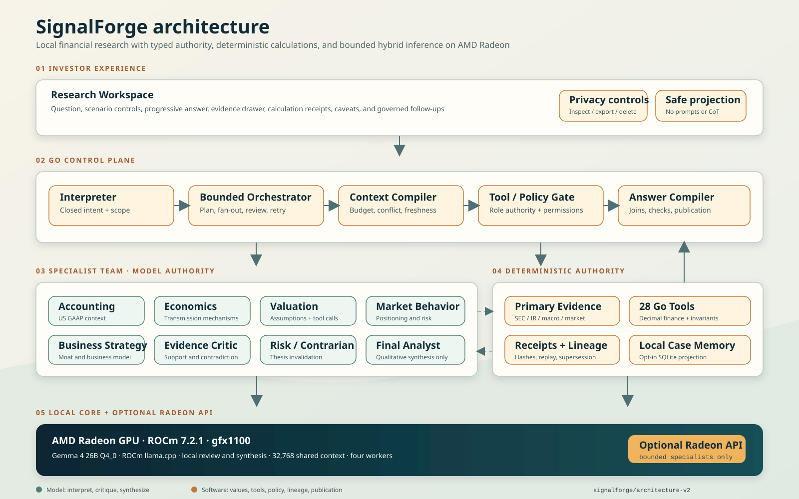
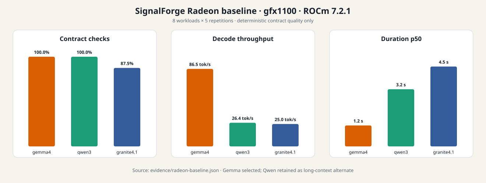
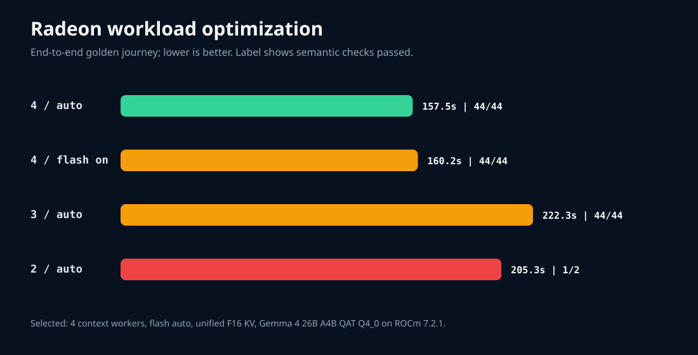
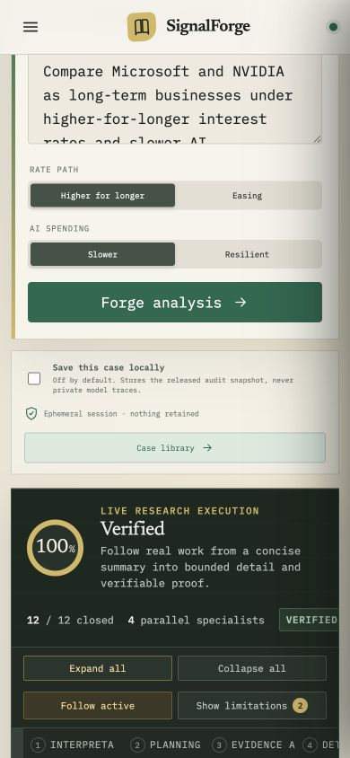
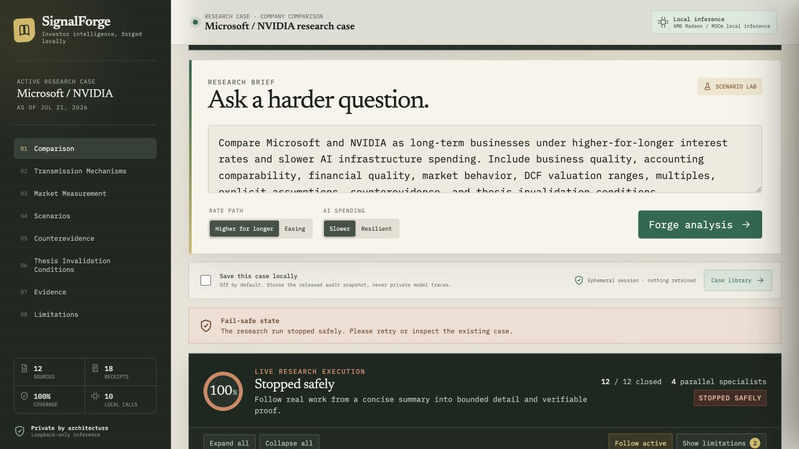
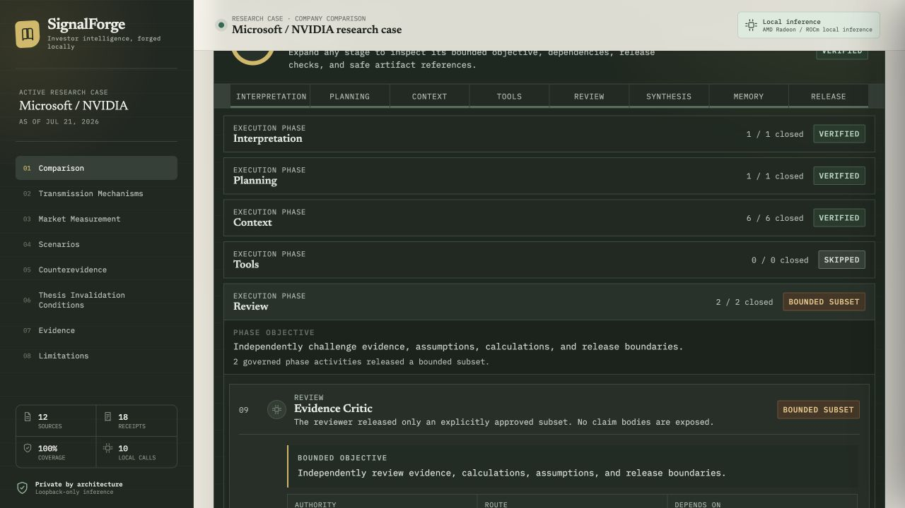
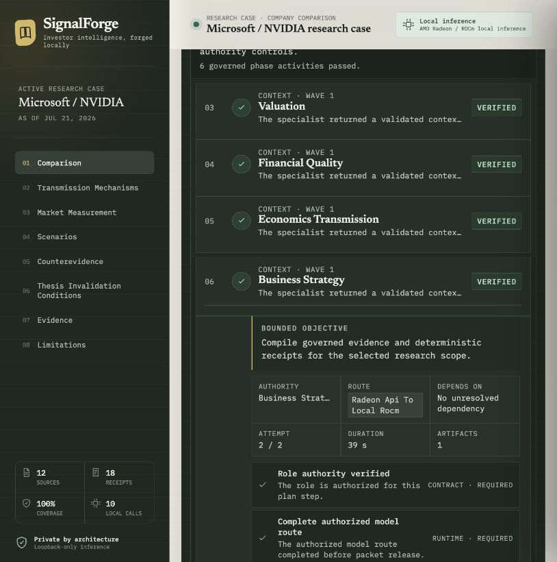

# SignalForge

SignalForge is a local-first financial research agent for turning public company filings,
macroeconomic series, and market data into auditable intelligence.

SignalForge is developed by **SignalForge Labs** for the AMD AI DevMaster Hackathon Track 2, with
core inference designed to run locally on AMD Radeon GPUs through ROCm.

## Judges: Start Here

The fastest review path is the [SignalForge Judge Guide](JUDGES.md). It maps the complete
120-point Track 2 rubric to the demo, deck, project specification, runtime evidence, and exact
championship release.

- [4 minute 45 second Radeon demo (284.970 seconds)](https://github.com/rvbernucci/signalforge/releases/download/sprint36-championship-v1/SignalForge-Radeon-Demo.mp4)
- [Six-slide judge deck](https://github.com/rvbernucci/signalforge/releases/download/sprint36-championship-v1/SignalForge-Judge-Deck.pptx)
- [Six-page project specification](https://github.com/rvbernucci/signalforge/releases/download/sprint36-championship-v1/SignalForge-Project-Specification.pdf)
- [Official Track 2 compliance matrix](docs/track2-compliance.md)
- [Current Radeon demo journey](evidence/sprint36-radeon-demo-journey.json)
- [Current artifact hashes](evidence/judge-package.json)

The immutable championship source is
`bc9c64746589e79766b2b18226ebb9d1d87d2585`. Its public image is
`ghcr.io/rvbernucci/signalforge:v1.1.1`, pinned by index digest
`sha256:cbac58cf3e62df0404e9ef1cfc7db6aec49e491e4beb5e1f214d6d562fad814b`.
Historical `v1.1.0` remains byte-identical and available as the rollback.

## Goal

Build a private research desk where specialist agents can:

- retrieve financial and macroeconomic evidence;
- calculate deterministic financial metrics;
- reason over accounting context;
- preserve local memory;
- produce clear, evidence-grounded analysis.

## Golden Vertical

The first complete journey compares Microsoft (`CIK 0000789019`) and NVIDIA
(`CIK 0001045810`) as long-term businesses under higher-for-longer interest rates and slower AI
infrastructure spending. SignalForge exposes the financial evidence, transmission mechanisms,
valuation assumptions, scenarios, and thesis-invalidating observations rather than naming an
unqualified winner.

## What Can I Ask?

SignalForge is designed for bounded research questions such as:

- "How would higher-for-longer interest rates affect Microsoft and NVIDIA through operating
  performance, financing conditions, and valuation assumptions?"
- "Which evidence supports or weakens NVIDIA's current investment thesis, and what should I monitor
  next?"
- "Is Microsoft comparable with Alphabet on this metric, or do accounting perimeter, segment, and
  fiscal-period differences make the comparison unsafe?"

The system may narrow or decline a question when evidence, temporal scope, company activation, or
comparison authority is insufficient.

## Quick Start

The deterministic fixture is the primary reproduction path. It requires no GPU, API key, model
download, database setup, or external network call after dependencies are installed.

```bash
git clone https://github.com/rvbernucci/signalforge.git
cd signalforge
npm --prefix web ci
npm --prefix web run build
go run ./cmd/signalforge-workspace --mode fixture --static-dir web/dist
```

Open `http://127.0.0.1:8080`. Run `scripts/verify.sh` to execute the complete repository, evidence,
frontend, and clean-output contract suite after installing its small Python dependency with
`python3 -m pip install -r requirements-verify.txt`. Live Radeon inference is documented under
[Reproduce The Selected Radeon Runtime](#reproduce-the-selected-radeon-runtime).

For a clean container reproduction, including the optional Radeon Mission Control stack:

```bash
make fixture-up          # Workspace only
make mission-control-up  # Workspace plus Grafana, Prometheus, Loki, Tempo, and Alloy
```

Both ports bind to loopback. Fixture inference requires no GPU, model, credential, or remote API.
See [Radeon Mission Control](docs/radeon-mission-control.md) for the four dashboards, the protected
Inference Inspector, privacy boundaries, and exact validation commands.

For a fresh AMD OneClick workspace with this public repository on `main` and persistent
`/workspace` storage, the canonical Radeon path is:

```bash
make radeon-bootstrap BACKEND=auto ACCEPT_GEMMA_LICENSE=yes
make radeon-up BACKEND=auto
```

These commands intentionally select the accepted `v1.1.1` rollback authority. The promoted
Technology 20 Sprint 41 candidate remains opt-in until its remaining exact-runtime, factual,
usability, rights, media, and final-release gates close:

```bash
make radeon-bootstrap \
  MANIFEST=deploy/radeon/appliance-manifest.vnext.json \
  BACKEND=auto \
  ACCEPT_GEMMA_LICENSE=yes
make radeon-up \
  MANIFEST=deploy/radeon/appliance-manifest.vnext.json \
  BACKEND=auto
```

Bootstrap records the selected manifest path and SHA-256 in private generated state. Preflight,
startup, Compose, native execution, and status reject conflicting selectors or changed manifest
bytes. Native execution also resolves `application.source_commit` from that authority, requires
the Git object to exist locally, materializes it into an isolated persistent tree, and builds and
serves the application assets from that exact commit. A receipt or cached binary tied to another
manifest, manifest SHA, declared commit, or resolved commit fails closed before the application
receives the organizer API-key file path.

`auto` uses digest-pinned Docker Compose services when Docker is healthy and otherwise uses the
native ROCm toolchain already present in the AMD image. Bootstrap installs no host packages,
copies no Mac files, and writes no model weight to Git. It provisions pinned toolchains under
persistent storage, downloads the separately licensed Gemma artifact only after explicit
acceptance, uses region-accessible transports while preserving canonical artifact identities,
verifies byte size and SHA-256 before publication, and reuses the verified cache on later starts.
See [Zero-Touch Radeon Appliance](docs/radeon-zero-touch-appliance.md).

## Technology 20 vNext Candidate

The current `main` branch contains a guarded expansion from the immutable Microsoft/NVIDIA
baseline to twenty US-listed technology issuers. All twenty company authorities and five bounded
peer lanes are promoted under one hash-bound human decision and four exact evaluation summaries.
This does **not** make every metric directly comparable or establish universal factual accuracy.

The vNext lane currently provides:

- a governed issuer and share-class catalog for twenty companies;
- SEC-first point-in-time data authority and deterministic financial-activation reports;
- one hash-bound accounting-authority packet per issuer, covering 160 canonical
  company-operation inputs with explicit concept, period, unit, currency, dimension, amendment,
  freshness, and review gates;
- fail-closed accounting dispositions: canonical mappings may become calculation authority, while
  aliases, issuer-specific concepts, context-only observations, rejected mappings, and unavailable
  inputs remain non-authoritative until their documented review is accepted;
- 80 baseline standalone development journeys plus a separate 60-case public augmentation for
  economics, valuation-readiness, and thesis monitoring; sealed evaluation remains isolated;
- five bounded peer lanes with metric-level `comparable`,
  `comparable_with_caveat`, `not_comparable`, or `unavailable` dispositions;
- a value-free peer-boundary matrix exposing definitions, fiscal periods, taxonomy, units,
  dimensions, accounting perimeters, segment scope, security identity, caveats, and explicit
  non-activation of market dates and security classes;
- a peer policy that prevents individually valid company metrics from becoming an unauthorized
  cross-company direction;
- local Radeon semantic evaluation with both independent critics and one final synthesis;
- a workspace that exposes company authority, evidence recency, governed periods, explicit
  unavailable price dates, scenario assumptions, deterministic receipts, abstentions,
  metric-level peer dispositions, and adjacent comparison caveats without expanding authority
  beyond the promoted company or lane; and
- fail-closed workspace states that preserve the last accepted case when the local model,
  optional API, retrieval, or a deterministic tool is unavailable.

The promotion is bound to source `4498e60c16821586f830d196269f39702f38ca99`, its four aggregate
evaluation hashes, the named decision hash, and the public
[Technology 20 promotion manifest](evidence/technology20-promotion-manifest.json). All 180
development and sealed journeys passed their bounded contract and runtime gates. Context-only,
unavailable, or non-comparable metrics remain withheld even inside a promoted lane.

The current exact vNext application source is
`ce4f2cabf0981bec09cf80c805864515f42fa41c`; its public `linux/amd64` image index is
`sha256:2537c832a43b3e71e2352d18ae959803c2b2a218133517e96c4526ee0aeb3ab3`.
It retains up to four concurrent specialist calls inside one research journey while admitting one
complete local journey at a time. In a controlled Radeon replay, two representative journeys
submitted together both completed through this shared gate. The second journey included queue
time, and the result does not satisfy or claim the 30-second response target.
Private prompts, responses, source bodies, model weights, sealed labels, and raw evaluation
reports are intentionally absent from this repository. Public promotion proves bounded authority,
not universal factual accuracy or final championship release.

## Project Documentation

- [Project specification PDF](output/pdf/SignalForge-Project-Specification.pdf)
- [Six-slide judge deck](output/presentation/SignalForge-Judge-Deck.pptx)
- [Architecture diagram](docs/architecture.svg)
- [4 minute 45 second Radeon demo (284.970 seconds)](output/video/SignalForge-Radeon-Demo.mp4)
- [Final demo cut sheet](docs/demo-script.md)
- [Evidence and reproduction guide](evidence/README.md)
- [Radeon Mission Control and container guide](docs/radeon-mission-control.md)
- [Sprint 36 championship artifact release](https://github.com/rvbernucci/signalforge/releases/tag/sprint36-championship-v1)
- [Sprint 36 artifact manifest](evidence/judge-package.json)
- [Sprint 36 release attestation](evidence/sprint36-release-attestation.json)
- [Historical Sprint 34 release attestation](evidence/sprint34-release-attestation.json)
<!-- evidence-claim:judge-evidence-drafts -->



The frozen release diagram labels the immutable 28-operation Tier 0 tool core. The current runtime
composes that core with the 52-operation Financial Intelligence Registry, yielding the 80
role-authorized deterministic operations described below. The diagram remains byte-identical to the
released judge package; this note prevents the historical Tier 0 label from being read as the
current catalog total. The total describes registered operation coverage, not a claim that every
natural-language request can automatically select every operation; request planning and company
activation remain independent fail-closed gates.

## Status

Tag `v1.1.1` is the forward championship release. Its public `linux/amd64` image adds the verified
runtime notice bundle and is bound to the current judge artifacts and Sprint 36 Radeon evidence.
The exact source, image, SBOM, provenance, Trivy result, anonymous pull, and Radeon readback are
frozen in the [Sprint 36 release attestation](evidence/sprint36-release-attestation.json).
Tag `v1.1.0` remains the immutable Sprint 34 rollback, and `v1.0.0` remains the independently
reproducible baseline. Native Radeon measurements remain bounded to their recorded workloads and
are not universal model-quality claims.
<!-- evidence-claim:sprint36-exact-release -->

- versioned Go contracts for specialist context, deterministic engine requests and receipts, and evaluation evidence;
- fail-closed validation for unsupported facts, unproven numerical inputs, and failed invariants;
- a secret-safe environment diagnostic for reproducible Radeon/ROCm evidence;
- a score ledger that separates planned claims from verified artifacts;
- canonical point-in-time SEC data contracts and a read-only SEC Submissions/Company Facts client;
- immutable, content-addressed raw storage with separate retrieval observations;
- fail-closed SEC parsing, historical-submission joins, amendment-aware point-in-time normalization,
  JSONL derivation, and DuckDB/Parquet export;
- a frozen 28-operation Tier 0 baseline with role-based, fail-closed permissions and one
  golden specification case per baseline operation;
  <!-- evidence-claim:tier0-golden-coverage -->
- a separate 52-operation financial-intelligence registry, composed with Tier 0 at runtime without
  changing its frozen identity, plus 80 canonical metric definitions, typed period/sign
  normalization, independent numerical references, and numerically silent model packets;
- an immutable registry for 11 logical roles with artifact, tool, retry, timeout, and memory authority;
- a versioned eight-intent taxonomy with 24 frozen routing cases;
- typed research, planning, evidence, critique, final-answer, memory, and failure contracts;
- a bounded Go orchestration state machine with deterministic request parsing, closed intents,
  at-most-one retries, cancellation, deadlines, four-specialist fan-out, review gates, one final
  synthesizer, structured progress events, and private atomic traces;
  <!-- evidence-claim:typed-orchestration -->
- schema-constrained local adapters and versioned prompts for all 11 logical roles, with Go-owned
  envelope construction, evidence authorization, and fail-closed contract validation;
- a Numerical Silence boundary with typed numerical variables and relations, decimal direction
  checks, exact fiscal-period identity, closed model-visible references, digit- and word-form
  leakage containment, one bounded semantic repair, Go-owned quantitative rendering, and
  deterministic protection for engine-authored calculation findings;
- a unified fake-provider chaos suite for malformed JSON, bounded truncation recovery, timeout,
  invented references, contradictory review, and partial-specialist degradation;
- governed follow-up envelopes that preserve parent identity, point-in-time scope, entities,
  comparison mode, and evidence/receipt lineage while requiring fresh authorization in every run;
- a responsive React/TypeScript Research View that keeps the answer, comparison, evidence, and
  dialogue surfaces primary, with only a compact execution status visible by default;
- an on-demand Audit View that expands the signed plan, role and route decisions, authorized
  sources, deterministic calculations, lineage, model/runtime identity, timing, and Mission
  Control links without exposing prompts, response bodies, credentials, or private reasoning;
- stable judge navigation through `?view=audit&audience=judge`, backed by the same signed
  projection as the user-facing answer rather than a second execution authority;
- privacy-safe OpenTelemetry, bounded Prometheus metrics, structured JSONL events, a resilient
  `amd-smi`/`rocm-smi` exporter, and four provisioned Grafana Mission Control dashboards;
- reproducible `linux/amd64` fixture, local-only, championship, and observability container
  surfaces, plus an automatic native ROCm fallback for AMD OneClick workspaces without Docker;
- a separate, resumable and hash-verified model-hydration phase, persistent cache, file-mounted
  secrets, and startup refusal against partial or mismatched weights;
- a deterministic Context Compiler that preserves conflicts, applies an explicit finding-statement
  budget, and emits governed evidence context;
  <!-- evidence-claim:context-compiler -->
- a bounded Microsoft/NVIDIA investor-relations source map with authority, temporal, rights, and
  supersession gates, plus a seven-document hash-addressed golden manifest;
- a governed 20-company US technology investor-relations registry, official-source discovery and
  collection tooling, immutable lineage, rights quarantine, narrative projection, chunking,
  retrieval evaluation, and a citation-resolving Go query boundary;
- a 17-question retrieval evaluation over 25 regulatory and investor-relations chunks; BM25 with
  financial-concept expansion returned the complete labeled evidence set for every frozen question;
  <!-- evidence-claim:retrieval-foundation -->
- `cockroachdb/apd/v3 v3.2.3` decimal policy, typed financial quantities, and portable JSON Schemas;
- pure-Go `modernc.org/sqlite v1.38.2` local case retention with hash verification and restrictive
  filesystem permissions;
  <!-- evidence-claim:decimal-policy -->
- one golden case for each of 28 Tier 0 operations and five independent Python reference checks;
- a role-authorized executor for all 28 Tier 0 operations, immutable calculation receipts,
  replay verification, and append-only supersession records;
- deterministic financial-intelligence engines for cash generation, returns, quality, capital
  allocation, valuation, peer analysis, and non-causal association, with fail-closed domain,
  period, denominator, and applicability controls;
- an optional hybrid runtime that keeps planning, numerical authority, review, rendering, and
  fallback under SignalForge control while sending only the bounded context-specialist wave to a
  runtime-configured Radeon Cloud vLLM endpoint;
- automated tests covering architecture, authority, evidence, and numerical validation.

The production SEC path retrieves root and historical Submissions, bounded primary filing
documents, and Company Facts; preserves immutable raw observations; joins facts to exact filing
acceptance timestamps; and emits point-in-time JSONL plus DuckDB/Parquet analytics. A live
Microsoft/NVIDIA run produced 6,935 filings, 58,973 reported facts, and 1,946 normalized metrics
with no future-available metric in the frozen replay. Counts are a dated observation, not a stable
property of the SEC dataset.
<!-- evidence-claim:sec-ingestion-path -->

The frozen structural evaluation selected separate Interpreter and Orchestrator contracts with
100% mandatory-role recall on 24 labeled cases. The Sprint 06 evaluation also passed every
intent, clarification, required-role, required-capability, authorization, risk-boundary, plan,
review-gate, conflict-preservation, trace-privacy, and bounded-workflow check; 20 non-ambiguous
cases completed the synthetic typed runtime end to end. These remain orchestration-contract
checks rather than local-model quality claims. The multi-turn workspace and controlled ROCm
optimization are implemented and independently reproducible.
<!-- evidence-claim:architecture-routing-eval -->

## Radeon Baseline

The frozen eight-workload tournament compared three hash-pinned Radeon deployment profiles and
selected the official Gemma 4 26B A4B Instruct QAT Q4_0 GGUF on ROCm `llama.cpp`. Gemma passed
40/40 deterministic contract checks and reached 86.46 median decode tokens/s on the allocated
`gfx1100` Radeon. Qwen3 8B BF16 on vLLM also passed 40/40 and remains a long-context alternate;
Granite 4.1 8B BF16 on vLLM passed 35/40 and failed all five short structured-output contract
checks. These results compare complete deployment profiles under the same bounded application
suite, not universal model quality.
<!-- evidence-claim:radeon-model-baseline -->

Google's
[upstream model card](https://huggingface.co/google/gemma-4-26B-A4B-it-qat-q4_0-gguf/blob/d1c082be9cf3c8a514acf63b8761f4b41935842e/README.md)
reports 25.2B total and 3.8B active parameters for the Gemma 4 26B A4B MoE model. SignalForge uses
the QAT Q4_0 GGUF variant. The 86.46 median decode rate above comes from five repetitions of the
frozen eight-workload deterministic-contract suite; it is not a single-stream dense-model
microbenchmark and should not be generalized across models, runtimes, precisions, or workloads.



The compact result and exact candidate identities are in
[`evidence/radeon-baseline.json`](evidence/radeon-baseline.json). Raw responses and runtime logs
are intentionally excluded from the clean repository, while their SHA-256 identities remain in
the public evidence.

## Radeon Workload Optimization

The workload-specific optimization found a reliability defect before it found a speed win. An
explicit four-slot launch without unified KV divided the configured 32,768-token context into four
8,192-token slot budgets. It rejected all long-context cases and passed only 70/80 observations.
Unified F16 KV restored the intended shared 32,768-token request capacity and passed 80/80 isolated
and concurrent contract observations.

The frozen product journey then selected four context workers, flash attention `auto`, continuous
batching, and the unified F16 cache. It passed all 44 predeclared semantic checks in 157.47 seconds,
29.17% faster end to end than the three-worker run, which also passed 44/44. Forced flash attention
was slower on the full journey despite a promising microbenchmark; a larger micro-batch increased
VRAM and did not improve the accepted tail; Q8 KV reduced contract success and was rejected.
These are controlled workload results, not universal model-quality claims.
<!-- evidence-claim:radeon-workload-optimization -->



The complete decision, rejected candidates, artifact hashes, and privacy-safe run projections are
in [`evidence/radeon-optimization.json`](evidence/radeon-optimization.json).

### Bounded Three-Mode Latency Tournament

In a bounded, non-sealed development tournament of eight public journeys per mode, local
four-worker execution passed 8/8 contracts and achieved a 2.7777x aggregate speedup with a 64.37%
p50 reduction versus the local two-worker baseline; hybrid four-worker execution passed 8/8 and
recorded 20 successful Radeon API calls with one failed remote call recovered locally.
<!-- evidence-claim:sprint33-latency-tournament -->

These are journey-level measurements of complete governed multi-agent cases on the selected Gemma
deployment profile, including planning, specialist execution, retrieval, deterministic engines,
review, and synthesis. They are distinct from the eight-workload decode measurement above.

The result is workload-specific development evidence, not external factual accuracy or universal
GPU performance. The privacy-safe [aggregate](evidence/sprint33-latency-tournament.json) omits
prompts, responses, per-case identifiers, excerpts, private reasoning, and credentials. Recompute
every published delta with `python3 scripts/verify_sprint33_latency_tournament.py`.

## Adversarial Hardening

The frozen Sprint 12 matrix covers 26 adversarial cases across data authority, calculations,
retrieval, local agents, tools, memory, privacy, responsible use, startup, and demo load. Its 22
critical and four high-severity cases execute through 11 repository gates; all gates pass and no
current release blocker remains.

The hardening added application-owned quarantine for high-confidence instructions embedded in
retrieved evidence, stricter point-in-time and OHLCV market validation, and a final responsible-use
gate that rejects direct trading instructions and guaranteed outcomes. It also verifies isolated
secret-free fixture startup and a 96-request concurrent workspace read load. These controls
complement the existing receipt replay, citation resolution, closed evidence IDs, provider chaos,
tool authorization, governed follow-ups, case-store privacy, and safe public projection.

This is bounded executable evidence, not proof of universal factual accuracy. Obfuscated prompt
injection, plausible upstream data errors, semantic citation entailment, full process supervision,
and concurrent 26B generation remain explicit residual risks.
<!-- evidence-claim:adversarial-hardening -->

The matrix, commands, owners, mitigations, and residual risks are in
[`configs/hardening/sprint12-matrix-v1.json`](configs/hardening/sprint12-matrix-v1.json); the
deterministic result is in [`evidence/hardening-matrix.json`](evidence/hardening-matrix.json).

## Local Specialist Evaluation

All 11 logical roles use one shared local Gemma runtime with role-specific prompts and strict JSON
Schema decoding. On a separately frozen 33-case role suite, the historical prompt set v5 passed 29/33 cases
(87.88%). Every role passed at least one of its three cases. Four outputs were rejected rather than
silently released: one unsupported accounting inference, one economics boundary miss, and two
market packets containing uncited claims. The earlier prompt v1-v4 reports are adaptive development
history and are not represented as held-out results. The historical prompt v8 migration added
Numerical Silence and reviewer-authority boundaries. Its audit on the unchanged suite passed 26/33; all
three Final Analyst cases failed because the old role-only contract expected numerical literals
that v8 now withholds for Go rendering. This result is not presented as a replacement held-out
score. The current prompt set is v12. Its complete rendered journey is evaluated separately against
a pre-run frozen semantic rubric rather than being compared with the historical role-only suite.

The hash-bound migration report is available at
[`evidence/role-eval-gemma4-26b-q4-heldout-v8-migration.json`](evidence/role-eval-gemma4-26b-q4-heldout-v8-migration.json).
<!-- evidence-claim:local-specialist-heldout -->

A measured Radeon run also completed the typed Business Strategy, Evidence Critic, and Final
Research Analyst path in 12.52 seconds. It produced seven orchestration events, a contract-valid
answer, and no runtime failure while using only the local OpenAI-compatible endpoint. This is a
bounded contract-path evaluation with a frozen local material provider, not yet the complete SEC,
macro, valuation, and market golden journey.
<!-- evidence-claim:local-orchestration-path -->

## Golden Radeon Decision Replay

The current privacy-safe golden artifact records a successful six-specialist, two-reviewer-role local
run on Radeon `gfx1100`, ROCm 7.2.1, and the selected Gemma 4 QAT Q4_0 `llama.cpp` runtime. Run
`golden-run-20260722-v57` finished in 154.33 seconds, dispositioned all 42 supplied
claims, released 31 claims with explicit evidence, receipt, numerical, or assumption authority,
and preserved complete evidence coverage. Both independent reviewers approved every released
claim. No remote inference was used.

The public replay contains route reasons, artifact hashes, claim dispositions, latency and token
aggregates, and hash-pinned runtime identity. It excludes prompts, responses, source excerpts,
free-form failure messages, and private reasoning. Validate it with:

```bash
go run ./cmd/signalforge-validate-replay \
  --input evidence/golden-safe-decision-replay.json
```

This run proves the local orchestration, review, Numerical Silence, deterministic DCF, sensitivity,
peer-multiple, and safe-replay boundaries. The frozen input set includes official exchange closing
prices captured before the analysis as-of boundary, enabling two validated peer-multiple receipts.
The eight-section answer passed all 44 checks in an independently frozen semantic contract covering
role authority, evidence joins, macro transmission, market behavior, valuation scenarios,
deterministic units and directions, availability reconciliation, and presentation integrity.

The machine-checked [`golden-journey-scorecard.json`](evidence/golden-journey-scorecard.json)
separates these measured properties from unproven quality claims. It records 42 explicit claim
dispositions, 31 released claims with authority and approval from both reviewer roles, complete evidence
coverage, six passing chaos cases, three passing governed follow-ups, and 44/44 frozen semantic
checks. This is contract conformance, not a claim of perfect factual accuracy; external answer
accuracy remains unscored against an independent human ground truth.
<!-- evidence-claim:golden-radeon-decision -->

## Research Workspace

SignalForge presents the golden journey as a responsive research desk rather than a raw chat or
terminal log. It separates the readable investment analysis from source evidence, successful
calculation receipts, assumptions, limitations, and system caveats. Streamed events expose bounded
orchestration status without exposing prompts, response bodies, token details, or chain-of-thought.

The default Research View keeps the conversation, readable answer, comparison, sources, and
calculation findings in the foreground. A compact status surface reports progress without turning
the product into an operations console. The user or judge can select **How SignalForge reached this
answer** to open the Audit View; `?view=audit&audience=judge` provides a stable review entry point.

Every accepted research plan is projected into that independently expandable audit workspace. It
shows the bounded objective, role authority, dependency graph, execution wave, route reason,
attempts, duration, release checks, authorized sources, deterministic receipts, model/runtime
identity, and safe artifact IDs. Active steps expand automatically; completed steps remain
available for inspection. Proof, lineage, and Mission Control actions reuse the existing signed
projection rather than creating a second execution authority.

The dashboard is observational only. A three-journey ablation compares execution with the event
projection disabled and enabled, proving identical model-adapter call counts, canonical request
and response payloads, final answer bytes, and orchestration-event counts. Identical payload bytes
also imply identical token counts for any deterministic tokenizer under the same adapter
configuration.

Accepted-workload CPU evidence separates deterministic projection cost from nondeterministic model
generation. Five `linux/amd64` repetitions on an AMD EPYC 9334 measured 30.758 ms of median
incremental projection work. A separately hash-bound accepted local Radeon journey consumed
270.013214 seconds of complete-journey CPU over ten model calls, producing a conservative
**0.011391362%** upper bound against the strict one-percent gate. The raw model A/B pairing was
deliberately excluded from the decision because changing repair behavior and generated-token counts
would confound model variance with dashboard cost. Reproduce the bounded calculation with
`python3 scripts/build_dashboard_cpu_evidence.py --benchmark
evidence/dashboard-cpu-benchmark-radeon.txt --workload
evidence/dashboard-workload-cpu-radeon.json --output evidence/dashboard-cpu-evidence.json --check`.

For live runs, the Workspace plan and Radeon Mission Control share one canonical `run_id` and
deterministic `trace_id`. The browser verifies both identifiers before displaying lineage and
fails closed on a stale or cross-run observability record without affecting the answer path.

Two accepted Sprint 34 working-tree journey manifests recorded 11 local model calls and 17 hybrid
calls. Their companion capture manifest is retained as historical UI provenance and explicitly
records `exact_release_artifact: false`; its Mission Control frames do not expose enough matching
route state to serve as current judge-facing route proof. Current proof is provided instead by the
Sprint 36 local and hybrid records in
[`sprint36-radeon-local-journey.json`](evidence/sprint36-radeon-local-journey.json) and
[`sprint36-radeon-hybrid-journey.json`](evidence/sprint36-radeon-hybrid-journey.json), together with
the correlated current captures below.

The current judge-facing captures below supersede the Sprint 34 screenshots as visual route proof.
They show one accepted Sprint 36 hybrid journey under a shared `run_id` and `trace_id`.


_Accepted Sprint 36 hybrid journey. Every governed phase reached a terminal state before release._


_Mission Control shows provided Radeon API calls and local ROCm execution under the same run and
trace identity. Historical Sprint 34 captures remain reproducibility artifacts, not current
judge-facing route proof._

The same workspace was verified at a 390×844 responsive breakpoint without horizontal overflow.
Two additional hybrid retries reached every required phase but failed the final synthesis contract
and were stopped safely rather than releasing an unverified answer. That negative-path evidence is
preserved separately from the accepted journey and demonstrates the fail-closed release boundary.





Observed specialist adapters now publish the real authorized-retrieval lifecycle: started, passed,
degraded, or failed. BM25 providers report matched, selected, and rejected candidate counts; a
provider without that telemetry says it is unavailable. Only deterministic engines executed during
the current journey publish tool started, passed, or failed rows. Loading a precomputed receipt or
authorizing a capability never pretends that a tool ran. Evidence opens in the Evidence Drawer,
calculation receipts open in the Calculation Drawer, and both remain correlated with Mission
Control by safe IDs. The live stream never carries source bodies, query text, formula values, model
payloads, or financial outputs.

Interpretation and planning rows expose only the governed intent, resolved entity IDs, as-of and
depth boundaries, role topology, waves, concurrency, and named release/abstention conditions.
Specialist rows expose evidence coverage and bounded finding, counterevidence, conflict, uncertainty,
and missing-evidence counts. Review rows expose approved/rejected claim-ID and issue counts without
claim bodies. Final synthesis exposes only supported-claim coverage, mandatory-review count,
evidence/receipt reference counts, limitations, and section count. These operational summaries let
the user inspect what passed, degraded, or was withheld without turning the dashboard into a second
release authority.



_Completed CPU fixture capture from the current development tree._



_Recovered-degradation CPU fixture generated from the versioned
[`recovered-fallback-events.json`](fixtures/workspace/recovered-fallback-events.json) overlay. The
expanded Business Strategy step preserves the full `Radeon API to Local ROCm` route and the second
attempt. Exact release and Radeon captures remain separate promotion gates._

The canonical projection is available at
`GET /api/v1/runs/{run_id}/execution`. It is versioned, sequence-bound, SHA-256 signed, and embedded
in retained case projections. SSE reconnects can send `Last-Event-ID`; duplicates are ignored,
sequence gaps trigger canonical snapshot recovery, and a terminal step cannot be reopened by a
late event. The pure browser reconciler advances only an observation cursor; it never derives or
authorizes a backend transition. A failed mandatory step can close the run safely but cannot be
presented as a successful completion.

Operational replay retains at most 256 safe events per run and 64 completed run records. Active
runs are preserved, while explicitly saved cases remain independent in the user-controlled SQLite
store. This keeps long dashboard sessions bounded without converting observability into implicit
memory.

Model-call rows preserve only the observed route class, bounded attempt number, and call kind:
`primary`, `retry`, `fallback`, or `bounded_repair`. Classification compares route, failure state,
output budget, and an in-memory prompt fingerprint; prompt text and fingerprints are never
published. The execution card therefore distinguishes a real retry or repair from a primary call
without exposing private reasoning or changing model behavior.

The Go server has two modes:

- `fixture` replays the complete privacy-safe golden case without a GPU or model download;
- `live` runs the same interface against the loopback-only Gemma endpoint on Radeon/ROCm.

The measured fixture evaluation loaded the initial case in 1.257 ms, surfaced the first safe
progress event in 4.438 ms, and completed its 40-event replay in 324.573 ms on the dated
development run. These
are reproducible demo-path measurements, not Radeon inference latency. The frozen v57 golden local
journey completed in 154.33 seconds; current Sprint 36 local, hybrid, demo, resilience, and
exact-release measurements are reported separately in the evidence directory.
<!-- evidence-claim:research-workspace -->

### Private Local Case Memory

Research-case retention is explicit and off by default. Selecting **Save this case locally** stores
the released, privacy-safe workspace projection in a local SQLite database. The case library lets
the user inspect, export, and delete that snapshot. Every read verifies the projection SHA-256;
dedicated directories created by SignalForge use `0700`, the database file uses `0600`, and SQLite
secure deletion is enabled. Existing parent-directory permissions are never changed.

The live plan records the real policy lifecycle as `not_requested`, `requested`, `approved`,
`saved`, `unavailable`, `failed`, or `deleted`. An ephemeral run is explicitly marked skipped
rather than being presented as active memory, and deletion updates the live run projection when
that run is still resident. A successful answer remains valid if optional retention is unavailable
or fails.

The stored snapshot contains the user's research question and the answer already released through
the Numerical Silence and evidence gates. It does not contain internal model prompts, raw model
responses, source bodies, chain-of-thought, credentials, or unbounded model context. Credential-shaped
values reject the save without invalidating the completed analysis. A saved case is an audit artifact,
not numerical authority: future calculations must resolve canonical evidence and deterministic
receipts again.

Model tools are read-only by default. Durable save, export, and delete operations require explicit
user actions; external writes are unavailable in the bounded product. Timeout, cancellation, partial
specialist behavior, and a three-failure local-runtime circuit breaker preserve the last completed
case during degradation.
<!-- evidence-claim:local-case-controls -->

Run the complete fixture experience:

```bash
npm --prefix web ci
npm --prefix web run build
go run ./cmd/signalforge-workspace \
  --mode fixture \
  --static-dir web/dist
```

The default local database is `.signalforge/cases.db`. Use `--disable-case-store` for a fully
ephemeral session or `--case-db /private/path/cases.db` to choose another local path.

Open `http://127.0.0.1:8080`. To use live local inference, start the selected model endpoint first,
then run:

```bash
go run ./cmd/signalforge-workspace \
  --mode live \
  --static-dir web/dist \
  --base-url http://127.0.0.1:8000/v1 \
  --model signalforge-gemma4-26b-q4 \
  --context-concurrency 4 \
  --live-run-concurrency 1
```

The workspace refuses non-loopback bind addresses. When it runs on a Radeon host, access it through
an authenticated SSH tunnel rather than exposing the research API directly:

```bash
ssh -L 8080:127.0.0.1:8080 user@radeon-host
```

## Development

### Requirements And Dependency Locks

| Surface | Requirement | Reproducibility authority |
| --- | --- | --- |
| Go control plane | Go 1.25 or newer | `go.mod` and `go.sum` |
| Web workspace | Node.js 22 and npm | exact `web/package.json` versions plus `web/package-lock.json`; use `npm ci` |
| Verification scripts | Python 3.10 or newer, Git, and `jq` | `requirements-verify.txt` |
| SEC analytical export | Python plus DuckDB | `requirements-analytics.txt` |
| Retrieval experiments | Python, sentence-transformers, and Qdrant client | `requirements-retrieval.txt`; not required for fixture startup |
| Judge-document rebuild | Python plus ReportLab | `requirements-docs.txt`; generated PDF is already included |
| Local inference | ROCm 7.2.1, `gfx1100`, and pinned `llama.cpp`/Gemma revisions | `configs/runtime/gemma4-26b-q4-llama-rocm.json` |

The fixture and verification suite require no environment variables. Optional data-source settings
are documented with empty credential placeholders in `.env.example`; export only the variables you
need and never commit a populated `.env` file.

```bash
scripts/verify.sh
go run ./cmd/signalforge-diag --output environment-report.json
python3 scripts/audit_public_repo.py --output /tmp/signalforge-release-audit.json
```

The optional hybrid specialist path is disabled by default. When enabled, its provider, endpoint,
model IDs, timeout, and secret location are runtime inputs; no API credential is embedded in the
repository or binary. See
[`docs/hybrid-vllm-specialists.md`](docs/hybrid-vllm-specialists.md) for its trust boundary,
OpenBao-compatible secret mount, local fallback, and evidence requirements. A complete accepted
journey through the organizer-provided endpoint is recorded in
[`evidence/sprint36-radeon-hybrid-journey.json`](evidence/sprint36-radeon-hybrid-journey.json),
with correlated Workspace and Mission Control proof in
[`evidence/sprint36-radeon-demo-journey.json`](evidence/sprint36-radeon-demo-journey.json).
The older Sprint 34 runtime and synchronized-capture records remain explicitly historical.

The diagnostic records hardware and runtime capabilities when available. Missing optional ROCm
commands are reported as unavailable rather than causing the diagnostic to fail. It never reads or
prints environment variables.

Run the deterministic engine fixture and persist its hash-verifiable receipt outside Git:

```bash
go run ./cmd/signalforge-calculate \
  --request fixtures/engine/margin-request.json \
  --output /tmp/signalforge-margin-result.json \
  --receipt-store /tmp/signalforge-receipts \
  --code-commit "$(git rev-parse HEAD)"
```

### Reproduce The Selected Radeon Runtime

On a fresh AMD ROCm 7.2.1 `gfx1100` workspace, use the public repository and persistent
`/workspace` storage. No Mac-to-Radeon copy, preinstalled Go toolchain, Docker installation, or
manual model command is required:

```bash
make radeon-bootstrap BACKEND=auto ACCEPT_GEMMA_LICENSE=yes
make radeon-up BACKEND=auto
```

When the verified model is absent, bootstrap requests the Hugging Face read token through a hidden
terminal prompt and stores it only in the ignored `.secrets/` boundary. The model, Go toolchain,
`llama.cpp` source revision, application dependencies, and generated runtime state are pinned or
hash-verified before use. `BACKEND=auto` prefers healthy Compose and otherwise selects the native
OneClick path without installing duplicate host tooling.

```bash
make radeon-status BACKEND=auto
make radeon-logs BACKEND=auto
```

The model server binds to loopback and exposes an OpenAI-compatible API; the application is
published at `http://127.0.0.1:8080`. Native PID receipts, redacted logs, build receipts, model
readiness, and application state remain under `/workspace/signalforge-runtime`. The complete
backend, profile, cleanup, network, and interruption contracts are in
[Zero-Touch Radeon Appliance](docs/radeon-zero-touch-appliance.md).

After the runtime is ready, reproduce the contract suite and summary:

```bash
go run ./cmd/signalforge-benchmark \
  --model signalforge-gemma4-26b-q4 \
  --warmup-repetitions 1 \
  --repetitions 5 \
  --concurrency 4 \
  --output evidence/runs/local-gemma-baseline.json

python3 scripts/summarize_benchmark.py \
  evidence/runs/local-gemma-baseline.json \
  --output evidence/runs/local-gemma-baseline-summary.json
```

Run a controlled single-variable profile on the Radeon node with:

```bash
SIGNALFORGE_PROFILE_ID=local-reproduction \
SIGNALFORGE_FLASH_ATTN=auto \
SIGNALFORGE_KV_UNIFIED=on \
scripts/run_radeon_profile.sh
```

Evaluate all logical roles and the measured local orchestration path against an already running
endpoint:

```bash
go run ./cmd/signalforge-eval-roles \
  --base-url http://127.0.0.1:8000/v1 \
  --model signalforge-gemma4-26b-q4 \
  --suite fixtures/roles/held-out-cases.json \
  --output /tmp/signalforge-role-eval.json

go run ./cmd/signalforge-eval-local-path \
  --base-url http://127.0.0.1:8000/v1 \
  --model signalforge-gemma4-26b-q4 \
  --output /tmp/signalforge-local-path.json \
  --trace-dir /tmp/signalforge-local-traces
```

Model access remains subject to the upstream license and any Hugging Face access requirements.

### Troubleshooting

| Symptom | Resolution |
| --- | --- |
| The workspace returns a frontend `404` | Run `npm --prefix web ci` and `npm --prefix web run build`, then pass `--static-dir web/dist`. Generated `web/dist` files are intentionally not committed. |
| Fixture startup tries to reach a model | Confirm `--mode fixture`; this path must not receive `--base-url` or require a model endpoint. |
| Live mode cannot reach Gemma | Keep the model server on `127.0.0.1:8000`, verify its OpenAI-compatible `/v1/models` endpoint, and use the served name `signalforge-gemma4-26b-q4`. |
| Model hash verification fails | Download the exact revision and filename recorded in `configs/runtime/gemma4-26b-q4-llama-rocm.json`; do not rename or requantize it under the same profile ID. |
| ROCm or the GPU is not detected | Run `go run ./cmd/signalforge-diag`; compare the result with the pinned `gfx1100`/ROCm profile before changing runtime flags. |
| SEC responds with `403` or rejects the request | Set a descriptive `SIGNALFORGE_SEC_USER_AGENT` containing a real contact address and respect SEC request policies. |
| A release or evidence check reports stale hashes | Regenerate only the owning deterministic report after an intentional source change, review the diff, and rerun `scripts/verify.sh`; never edit hashes by hand. |

## Deterministic Financial Engine

The Go engine preserves the frozen 28-operation Tier 0 baseline and composes it with a separate
52-operation financial-intelligence registry, producing 80 active operations. Decimal arithmetic
remains authoritative for financial calculations, with declared `float64` policies limited to
statistical methods. It refuses unauthorized roles, unregistered inputs, future evidence,
incompatible units, currencies, or periods, failed invariants, and non-convergent solves. Every
registered operation has a complete required-input unit contract, enforced by a registry-wide
regression test. Receipts are canonical-hash verified;
corrections create append-only supersession records instead of mutating prior calculations.

The extended registry covers cash generation, returns, financial quality, capital allocation,
valuation, peer comparison, and lagged association. Its architecture, numerical boundary, and
bounded CPU and Radeon evidence are documented in
[`docs/financial-intelligence.md`](docs/financial-intelligence.md).

A dated `darwin/arm64` development-machine benchmark measured p95 latency of 42.71 microseconds
for a five-year FCFF DCF, 1.45 milliseconds for reverse DCF, 87.21 microseconds for beta over
10,000 observations, 36.39 milliseconds for a 961-cell DCF sensitivity grid, and 14.54
microseconds for full receipt construction. These are local CPU measurements, not Radeon claims.
<!-- evidence-claim:deterministic-engine -->

To ingest the golden companies from official SEC Submissions and Company Facts endpoints into an
immutable, hash-addressed raw store:

```bash
export SIGNALFORGE_SEC_USER_AGENT="SignalForge research your-email@example.com"
go run ./cmd/signalforge-ingest-sec \
  --cik 0000789019,0001045810 \
  --store ./var/raw > ./var/sec-ingestion.json

go run ./cmd/signalforge-transform-sec \
  --ingestion-result ./var/sec-ingestion.json \
  --raw-store ./var/raw \
  --output ./var/derived \
  --as-of 2026-07-21T16:00:00Z \
  --computed-at 2026-07-21T16:00:00Z

python3 -m pip install -r requirements-analytics.txt
python3 scripts/export_sec_analytics.py \
  --source ./var/derived \
  --output ./var/parquet \
  --database ./var/signalforge.duckdb
```

The raw store deduplicates identical content while preserving each retrieval as a separate
immutable observation. Downloaded data belongs under local runtime storage and must not be
committed to this repository. Historical submissions are enabled by default. Use
`--primary-documents N` to capture only a bounded number of latest 10-K/10-Q primary documents.
The `--as-of` boundary is mandatory so a replay cannot silently include evidence published later.

## Architecture Boundary

Language models may interpret evidence, plan research, and select registered tools. Material
financial calculations execute in deterministic Go engines and return immutable receipts with
inputs, assumptions, validation, provenance, and reproducibility hashes.

## License

Original SignalForge source code and documentation are licensed under the
[Apache License 2.0](LICENSE). Copyright 2026 Rafael Bernucci.

The license applies only to original SignalForge work. Model weights are not redistributed, and
Gemma 4, `llama.cpp`, ROCm, dependencies, fonts, services, and data sources remain governed by
their own licenses and terms. See [THIRD_PARTY_NOTICES.md](THIRD_PARTY_NOTICES.md) and
[NOTICE](NOTICE).
