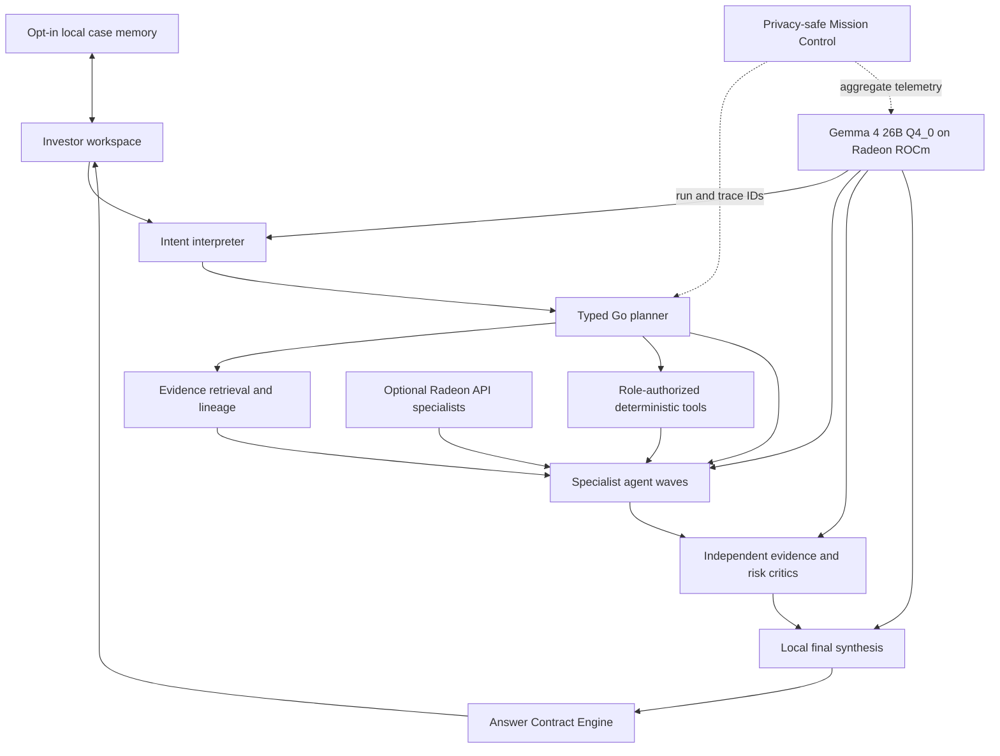

# SignalForge

SignalForge is a private, local-first financial research workspace for independent investors. It
turns public company evidence into an inspectable multi-agent process with deterministic financial
tools, citations, local memory, explicit permissions, independent review, and fail-closed release
contracts.

The project is built for **AMD AI DevMaster Hackathon Track 2**. Core inference runs locally on an
AMD Radeon GPU through ROCm. A bounded organizer-provided Radeon API route can accelerate selected
context specialists without replacing local authority, deterministic calculations, or final
validation.

> SignalForge can make mistakes. Verify important information and consult qualified professionals
> before making financial decisions. It is research software, not an audit, investment
> recommendation, fiduciary service, trading system, or guarantee.

## Judges

Start with the [Judge Guide](JUDGES.md). It maps the 120-point Track 2 rubric to the current
application, architecture, Radeon measurements, and privacy-safe evidence.

- [Demo video (4 min 26 s)](https://github.com/rvbernucci/signalforge/releases/download/v1.2.0/SignalForge-Radeon-Demo.mp4)
- [Project specification PDF](https://github.com/rvbernucci/signalforge/releases/download/v1.2.0/SignalForge-Project-Specification.pdf)
- [Judge deck](https://github.com/rvbernucci/signalforge/releases/download/v1.2.0/SignalForge-Judge-Deck.pptx)
- [Project specification](docs/project-specification.md)
- [Track 2 compliance map](docs/track2-compliance.md)
- [Architecture diagram](docs/architecture.svg)
- [Current evaluation summary](evidence/championship-evaluation.json)
- [Current Radeon runtime summary](evidence/championship-radeon-runtime.json)
- [Current product check](evidence/championship-product-check.json)
- [Accounting authority review](docs/accounting-authority/technology20-accounting-professional-review.md)

Public documents describe the current product only. Superseded experiments, working papers, raw
evaluation records, prompts, answers, private traces, and sealed labels are intentionally excluded
from this repository.

## Product

SignalForge helps a serious non-professional investor:

- understand what a company does, sells, and depends on;
- inspect financial fundamentals and their accounting boundaries;
- reason about macroeconomic transmission mechanisms;
- compare companies only when periods, units, definitions, and perimeters are compatible;
- explore valuation scenarios without presenting price predictions;
- learn finance and accounting through cited, real-company examples; and
- preserve or delete local research cases under explicit user control.

The governed universe contains 20 US-listed technology issuers:

`AAPL`, `MSFT`, `GOOGL`, `AMZN`, `META`, `NVDA`, `AMD`, `AVGO`, `INTC`, `QCOM`, `MU`,
`TXN`, `AMAT`, `ORCL`, `CRM`, `ADBE`, `NOW`, `CSCO`, `IBM`, and `ANET`.

Five peer lanes have explicit metric-level authority:

`Cisco/Arista`, `Microsoft/Alphabet`, `NVIDIA/AMD`, `Oracle/Microsoft`, and
`Salesforce/ServiceNow`.

Promotion never makes every metric comparable. Unsupported periods, missing evidence, accounting
perimeter conflicts, and overbroad requests remain unavailable or fail closed.

## Architecture



Go owns identity, scope, permissions, evidence authority, deterministic calculations, lineage,
comparison policy, validation, and publication. Models interpret evidence and produce bounded
qualitative drafts. A fluent model response is never the financial system of record.

### Numerical Silence

Models do not become the source of financial values. Deterministic engines compute and emit typed,
hash-verifiable receipts. The answer compiler can reference approved variables and relations, but
unsupported numbers never become authoritative through model prose.

### Agent Capabilities

SignalForge implements all five capability families listed by Track 2:

1. local knowledge retrieval with point-in-time lineage and citations;
2. tool invocation through a closed role-authorized registry;
3. multi-step planning with specialist waves, critics, repair, and synthesis;
4. local multi-turn memory with opt-in inspect, export, and delete; and
5. explicit permission and privacy controls.

The expandable execution plan shows each governed stage. The investor view stays concise; detailed
telemetry and intelligence lineage open only when requested.

## Quick Start

The deterministic fixture demonstrates the complete product contract without a GPU, model
download, API key, database setup, or external data call:

```bash
git clone https://github.com/rvbernucci/signalforge.git
cd signalforge
npm --prefix web ci
npm --prefix web run build
go run ./cmd/signalforge-workspace \
  --mode fixture \
  --static-dir web/dist
```

Open `http://127.0.0.1:8080`.

The default fixture:

- serves the investor and judge workspaces;
- streams the same typed execution-plan contract used by live mode;
- exposes evidence and deterministic receipts;
- keeps durable memory off by default; and
- requires no credential or network access.

### Verify The Repository

```bash
python3 -m venv .venv
source .venv/bin/activate
python3 -m pip install -r requirements-verify.txt
scripts/verify.sh
```

The gate runs frontend tests and build, Go race tests, `go vet`, reference-finance checks, Python
tests, adversarial hardening, appliance validation, observability validation, restricted-egress
audits, deterministic evaluations, and public-claim integrity checks.

### Verify The Container

```bash
scripts/verify_container_fixture.sh
```

This builds `linux/amd64`, starts the image without local setup, checks health and official
application behavior, verifies non-root and read-only boundaries, recreates the container against
the same persistent volume, and proves inspect/delete lifecycle behavior.

## AMD Radeon Runtime

The selected local profile is:

- AMD Radeon `gfx1100`, 47.98 GiB VRAM;
- host ROCm 7.2.1;
- Gemma 4 26B A4B Instruct QAT Q4_0;
- AMD-validated ROCm `llama.cpp`;
- 32,768-token context;
- four continuous-batching specialist slots; and
- unified F16 KV cache with Flash Attention set to `auto`.

The model is a separately licensed artifact and is not embedded in the application image. The
bootstrap downloads it only after explicit license acceptance, verifies its expected size and
SHA-256, and stores it under persistent Radeon workspace storage.

On a fresh AMD Radeon Cloud workspace:

```bash
make radeon-bootstrap \
  BACKEND=auto \
  ACCEPT_GEMMA_LICENSE=yes

make radeon-up \
  BACKEND=auto
```

`BACKEND=auto` uses Docker Compose when the host permits it and otherwise selects the pinned native
ROCm path. Bootstrap installs no host package and requires no Mac-side artifact copy. See
[Zero-Touch Radeon Appliance](docs/radeon-zero-touch-appliance.md).

### Hybrid Radeon API

The `championship` profile may send bounded qualitative context packets to organizer-provided
OpenAI-compatible Radeon API specialists. The API key is read from a runtime secret file and never
stored in source, image, logs, traces, or evidence.

```bash
make championship-up BACKEND=auto
```

The local path remains responsible for critics, final synthesis, deterministic authority, and
release validation. A remote failure falls back locally; loss of indispensable local authority
fails closed. See [Hybrid Specialist Runtime](docs/hybrid-vllm-specialists.md).

### Mission Control

```bash
make radeon-observe PROFILE=championship BACKEND=auto
```

The optional stack provides Grafana, Prometheus, Loki, Tempo, and Alloy on loopback-only ports. It
correlates the investor workspace, agent plan, tools, model routes, receipts, and failures through
privacy-safe `run_id` and `trace_id` values. It never records prompt bodies, answer bodies,
credentials, source bodies, chain-of-thought, or private memory.

See [Radeon Mission Control](docs/radeon-mission-control.md).

## Current Evidence

The frozen evaluation completed:

- `180/180` Radeon journeys with runtime and release-contract success across standalone and peer,
  development and sealed populations;
- `180/180` accepted by an independent model-assisted evidence-alignment review, including 18
  accepted with limitations and zero false-release candidates;
- `10/10` repeated financial-quality journeys;
- a 5 hour 28 minute soak with 1,945 telemetry samples, constant 32% allocated VRAM, and 63 C
  maximum observed junction temperature;
- `5/5` representative hybrid journeys, with the hybrid route retained only selectively;
- local recovery from optional API loss and fail-closed behavior when local authority was absent;
- a live Adobe standalone journey and a governed NVIDIA/AMD peer journey; and
- a deliberate fail-closed result for an overbroad peer request.

These are bounded engineering results. Model-assisted review is not independent human ground
truth, professional assurance, or final judging authority.

### Verified Application Image

The current application image is frozen and publicly pullable:

```text
ghcr.io/rvbernucci/signalforge@sha256:4b68c713e824d3cea9ad6a83cef4c93304961f9f3c3782a984af312bec47bf43
```

It was built from source commit `ac8685307a420e23f73632f0e59fc647e6fdd870` for `linux/amd64`.
The release workflow attached SBOM and provenance, found zero HIGH/CRITICAL vulnerabilities,
verified a clean public pull, and ran the exact image fixture. See
[`release-identity.json`](evidence/release-identity.json) and the
[`release-checklist.json`](evidence/release-checklist.json) for the completed release gates. The
synchronized [Mission Control runtime](evidence/mission-control-runtime.json) also passed against
this exact digest, including deliberate observability loss.

## Data, Rights, And Privacy

SignalForge uses public regulatory, macroeconomic, market, and official company sources under
source-specific policies. Source bodies with uncertain redistribution rights are referenced, not
republished. Restricted accounting publications, private authorial corpora, model weights,
credentials, raw provider payloads, prompts, answers, and hidden reasoning are excluded from the
public repository and application image.

Durable case retention is off by default. When enabled, only the released safe projection is stored
in local SQLite with integrity metadata and restrictive permissions. Users can inspect, export,
and delete retained cases.

See [THIRD_PARTY_NOTICES.md](THIRD_PARTY_NOTICES.md), [NOTICE](NOTICE), and the
[accounting authority review](docs/accounting-authority/technology20-accounting-professional-review.md).

## Repository Map

| Path | Purpose |
|---|---|
| `cmd/` | Application and reproducibility commands |
| `internal/` | Typed control plane, tools, agents, validation, memory, and data authority |
| `web/` | React investor and judge workspace |
| `contracts/` | Machine-readable transport and release schemas |
| `fixtures/` | Public-safe deterministic fixtures and governed product authority |
| `configs/` | Active prompt, retrieval, source, and Radeon runtime policies |
| `deploy/` | Radeon appliance and observability manifests |
| `scripts/` | Build, verification, data, Radeon, and release tooling |
| `docs/` | Current judge and operator documentation |
| `evidence/` | Current privacy-safe aggregate evidence and integrity receipts |

The public repository intentionally contains no sprint archive or superseded release narrative.

## Limitations

- SignalForge does not predict prices or issue personalized investment recommendations.
- Company and peer coverage is bounded to promoted authorities; unsupported comparisons abstain.
- External answer accuracy has not been scored against independent human ground truth.
- Citation presence does not by itself prove semantic entailment.
- The local 26B model limits whole-journey concurrency even though specialist calls can overlap.
- Literal OCI execution on some OneClick hosts depends on their container and mount policy; the
  current readback therefore used a clean Skopeo pull and Umoci extraction before executing the
  unchanged entrypoint payload as the image's non-root UID.
- The application image and exact-image Radeon readback are frozen. The project-owner release
  decision and exact media hashes are recorded in
  [`final-release-authority.json`](evidence/final-release-authority.json).

## License

SignalForge source code and original documentation are licensed under Apache-2.0. Third-party
software, fonts, models, services, and data remain under their respective terms.

<!-- evidence-claim:current-product -->
<!-- evidence-claim:current-evaluation -->
<!-- evidence-claim:current-radeon-runtime -->
<!-- evidence-claim:accounting-authority -->
<!-- evidence-claim:release-identity -->
<!-- evidence-claim:privacy-and-rights -->
