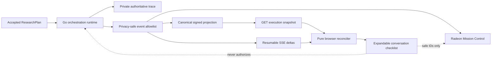

# Radeon Mission Control

Radeon Mission Control is SignalForge's optional, privacy-safe operational surface. It correlates
the investor workspace, agent orchestration, evidence retrieval, deterministic financial engines,
local or provided-model routes, and Radeon telemetry without exporting prompt bodies, answers,
private memory, raw financial values, credentials, or hidden reasoning.

## Surfaces

| Surface | Address | Purpose |
| --- | --- | --- |
| SignalForge Workspace | `http://127.0.0.1:8080` | Investor journey, specialist progress, answer, proof, and Intelligence Inspector |
| Grafana | `http://127.0.0.1:3000` | Four provisioned Mission Control dashboards |
| Prometheus | `http://127.0.0.1:9090` | Bounded aggregate metrics |
| Alloy status | `http://127.0.0.1:12345` | Collector health and pipeline status |

Loki and Tempo are intentionally not published to the host. Grafana reaches them on the private
Compose network.

## CPU Fixture

Docker is required. No GPU, model, model API, or network access is required by the application
journey.

```bash
make mission-control-up
```

The command creates a random local Grafana password in
`.secrets/grafana-admin-password`. Read it locally when signing in:

```bash
cat .secrets/grafana-admin-password
```

Run a case in the Workspace, then open **Intelligence path / Inspect orchestration**. Mission
Control collects the same safe execution events.

The conversation also contains a live, expandable execution plan derived from the same accepted
backend plan. Eight ordered parent phases remain visible throughout the journey: interpretation,
planning, context, tools, review, synthesis, memory, and release. Parent phases summarize governed
activity without becoming artificial progress steps. Each actual step can reveal its bounded
objective, authority, dependencies, wave, route, attempts, release checks, and safe artifact IDs.
**Open evidence** resolves authorized source
references, **Open calculations** resolves deterministic receipts, and **Inspect lineage** opens
Mission Control's correlated model, retrieval, engine, review, and release record. Neither surface
exposes raw prompts, raw model output, credentials, or chain-of-thought.

Every accepted live run carries a canonical `run_id` and a deterministic `trace_id` in the
Workspace run envelope. The expandable plan displays both safe identifiers, and the Intelligence
Inspector refuses to render a Mission Control record unless both identities match. A stale or
cross-run observability response therefore fails closed without affecting the research answer.

The safe operational projection includes intent and scope boundaries, plan topology, evidence
coverage and packet counts, deterministic input/output reference IDs, review disposition counts,
and final supported-claim coverage. Rejected claim bodies and answer bodies remain private.
Operational counts explain the gate result; they do not authorize a claim or reconstruct a
financial value.

Retrieval and deterministic tools use explicit lifecycle events. An observed retrieval reports
`started` followed by `passed`, `degraded`, or `failed`; BM25 providers include matched, selected,
and TopK-rejected candidate counts, while providers without rank telemetry report it as
`unavailable`. A deterministic engine reports `started` followed by `passed` or `failed` and
identifies only its execution, operation, formula, safe input/output references, invariants,
warnings, and receipt. A receipt loaded from prior governed computation is not relabeled as a tool
execution. Legacy adapters may expose only a validated completion boundary and cannot manufacture
earlier lifecycle states.

The canonical plan can be inspected directly:

```bash
curl -s http://127.0.0.1:8080/api/v1/runs/<run_id>/execution | jq
```

## Execution Plan Data Flow



The Go projection is the only public state authority. SSE carries bounded deltas; a reconnect or
sequence gap reloads the signed snapshot. The reducer renders but never derives a backend
transition. Workspace and Mission Control correlate through the same canonical `run_id` and
`trace_id`; the browser verifies that pair before rendering lineage. The private trace remains
separate.

The JSON response is versioned and SHA-256 signed. A pure browser reconciler deduplicates the SSE
sequence, detects gaps, and fetches this canonical snapshot after reconnects. It never applies plan
transitions itself, so observability can recover without becoming an execution authority. Stop the
stack with:

```bash
make mission-control-down
```

The observability cache retains at most 256 safe events per run and 64 completed run records.
Active runs are never evicted, and explicitly saved cases remain in the separate user-controlled
SQLite store. This bounds long dashboard sessions without turning ephemeral telemetry into durable
memory.

The same Makefile exposes the complete operating surface:

```bash
make radeon-local-up   # Local Gemma plus Mission Control
make championship-up  # Radeon API specialists, local Gemma, and Mission Control
make stack-status
make stack-logs
make evidence-export  # Public metadata only; protected bodies are excluded
make stack-down
```

## Current Radeon Captures

Sprint 36 records the current judge-facing hybrid journey under one canonical `run_id` and
`trace_id`. The Workspace reached 12/12 terminal steps before release, and Mission Control exposes
the bounded provided-API and local-ROCm routes without retaining protected model bodies.


The authoritative privacy-safe records are:

- `evidence/sprint36-radeon-local-journey.json`
- `evidence/sprint36-radeon-hybrid-journey.json`
- `evidence/sprint36-radeon-demo-journey.json`
- `evidence/sprint36-exact-release-radeon-journey.json`
- `evidence/sprint36-radeon-resilience.json`

## Historical Sprint 34 Capture Boundary

The Sprint 34 working tree produced accepted local and hybrid journey manifests plus four
hash-bound UI captures. That bundle explicitly records `exact_release_artifact: false`. Two Mission
Control frames preserve a loading or deterministic-fixture state rather than enough matching route
detail to substantiate the journey on their own. The immutable bundle therefore remains useful for
historical UI provenance and hash reproduction, but it is not used as current route proof.

The responsive Sprint 34 workspace was checked at 390×844 without horizontal overflow. Separate
hybrid retries exercised the visible phases but failed the final synthesis contract; the UI reported
`Stopped safely` and released no answer. Those retries are historical resilience evidence, not
accepted-journey or exact-release evidence.

The public historical manifests contain only timestamps, UUIDs, hashes, phase states, aggregate
counts, provider/route identifiers, role IDs, and token totals. They retain no questions, prompts,
answers, source bodies, credentials, or private reasoning. Reproduce the immutable capture manifest
with:

```bash
python3 scripts/build_dashboard_radeon_evidence.py \
  --local evidence/dashboard-radeon-local-journey.json \
  --hybrid evidence/dashboard-radeon-hybrid-journey.json \
  --local-plan docs/assets/sprint34-radeon-local-plan-expanded-1280x720.jpg \
  --local-mission docs/assets/sprint34-radeon-local-mission-control-1280x720.jpg \
  --hybrid-plan docs/assets/sprint34-radeon-hybrid-plan-expanded-1280x720.jpg \
  --hybrid-mission docs/assets/mission-control-radeon-hybrid-sprint34-viewport.jpg \
  --binary-sha256 0302c4580e1c8195547553bcc0b9b700452a11f00126a7d3fc76a5de1136ba4a \
  --frontend-sha256 7b362551b93737ea208e1c787dab85f856434869a478526520a789da3081a399 \
  --output evidence/dashboard-radeon-synchronized-captures.json \
  --check
```

The companion [`sprint34-radeon-runtime.json`](../evidence/sprint34-radeon-runtime.json) binds the
same candidate to ROCm 7.2.1, the `gfx1100` Radeon device, the quantized Gemma model hash, startup
time, complete-journey latency, aggregate utilization/VRAM/temperature/power measurements, and
three fail-closed recovery checks. It intentionally excludes raw telemetry and all protected
content.

## Execution Plan Troubleshooting

The execution plan is an observability projection, not an execution dependency. A dashboard,
browser, SSE, or Mission Control failure must never authorize, block, or rewrite a research answer.

| Symptom | Safe interpretation | Operator action |
|---|---|---|
| `Reconnecting to signed plan` remains visible | The browser retained the last valid snapshot and detected an unavailable stream or sequence gap. Research continues on the server. | Inspect `GET /api/v1/runs/<run_id>/execution`. Reload only after confirming the same `run_id`; do not resubmit the research question. |
| The browser shows an older sequence | A delayed GET or SSE response lost a race to a newer canonical snapshot. The reducer rejects cross-run and regressive state. | Compare `last_sequence` and `projection_sha256` with the canonical endpoint, then refresh the page. |
| Mission Control is unavailable | Deep telemetry is down; the Workspace answer path and private authoritative trace remain independent. | Run `make stack-status` and `make stack-logs`. Restore observability separately without restarting a completed research run. |
| A browser refresh occurs during a run | The current safe plan is reconstructed from the Go projection and SSE resumes after its last sequence. | Reopen the same run. If the run completed, inspect its final plan; persistence still follows the explicit retention choice. |
| Evidence or calculation action has no result | No authorized reference of that class was released for the selected step, or the referenced artifact is unavailable. | Treat the item as unavailable. Never infer a body, value, or receipt from the operational row. |
| A route badge changes from Radeon API to local ROCm | The primary authorized route failed and the bounded fallback completed. | Inspect the safe model-call lineage by `run_id`; do not interpret fallback as duplicate authority. |
| A model row reports retry or bounded repair | The runtime observed another authorized call for the same plan step after a failure, output-budget increase, or contract correction. | Compare its attempt and route class. Prompt and response bodies remain intentionally absent. |
| Memory is skipped, unavailable, failed, or deleted | Retention is optional and user-controlled; none of these states invalidates a released answer. | Save explicitly when needed. Inspect the case library for saved snapshots and use its two-step delete control. |

If the canonical projection fails validation or its hash does not match, stop displaying new plan
state and preserve the last valid snapshot. The final answer remains governed by the orchestration
and release contracts, never by reconstructed browser state.

`stack-down` stops containers and networks but deliberately preserves named data volumes and the
externally mounted model. Destructive cleanup is never part of a normal stop. If an operator later
chooses to remove disposable observability data, they must explicitly select the relevant named
volume after inspecting it; SignalForge never deletes the model path or retained research cases on
their behalf.

## Radeon Exporter

Run the exporter on the Radeon host, outside the observability containers, so it can use the
host's supported `amd-smi` or `rocm-smi` binary and device permissions:

```bash
make radeon-exporter
```

It binds to `127.0.0.1:9400`, tries `amd-smi` first, falls back to `rocm-smi`, exports only a
bounded GPU index plus utilization, VRAM, temperature, power, and collector availability, and
returns `radeon_gpu_exporter_up 0` rather than blocking SignalForge when telemetry is unavailable.

The ROCm profile passes `/dev/kfd` and `/dev/dri` without privileged mode. Because Radeon Cloud
images may expose numeric groups without names, inspect the device ownership on the allocated host
and override the defaults when needed:

```bash
stat -c '%g %n' /dev/kfd /dev/dri/renderD* 2>/dev/null
export SIGNALFORGE_VIDEO_GID=44
export SIGNALFORGE_RENDER_GID=109
```

Compose adds those numeric groups to the inference process; it does not depend on `video` or
`render` names existing inside the image.

## Traces

OpenTelemetry is opt-in:

```bash
export SIGNALFORGE_OTEL_ENABLED=true
export SIGNALFORGE_OTEL_INSECURE=true
export SIGNALFORGE_OTEL_ALLOW_PRIVATE_NETWORK=true
export OTEL_EXPORTER_OTLP_ENDPOINT=http://alloy:4318
```

The private-network permission only accepts a single-label Compose service such as `alloy`.
External collectors require HTTPS. Collector loss does not prevent journey completion; the batch
exporter times out independently.

## Protected Model I/O

Protected diagnostic capture is off by default. Enabling it requires a token mounted from a file,
never a browser-persisted or command-line token:

```bash
umask 077
printf '%s' "$(openssl rand -base64 30)" > .secrets/audit-operator-token
```

Add `--audit-capture --audit-token-file /run/secrets/audit_operator_token` to the application and
mount the file read-only. The Intelligence Inspector keeps the entered token only in React
component memory. Captured bodies are sanitized, bounded to 16 MiB per run by default, expire
after 15 minutes, and can be purged immediately. Metadata hashes and lineage remain after body
expiry so the execution is still auditable.

## Data Boundaries

Prometheus labels are limited to role class, provider class, route, operation class, capture state,
and typed status. Run IDs, trace IDs, companies, tickers, users, models, URLs, prompts, answers, and
errors never become metric labels.

Loki receives JSON lifecycle events containing safe IDs, hashes, bounded states, durations, and
token counts. Tempo receives the same safe identity spine as span attributes. Exact sanitized
model input/output is written only to the opt-in local audit vault and is never exported to
Prometheus, Loki, or Tempo.

## Dashboards

1. **Executive Journey** shows completion, end-to-end latency, context packets, receipts, and the
   live lifecycle timeline.
2. **Radeon Performance** shows GPU utilization, VRAM, temperature, power, and observed model
   latency.
3. **Agent Orchestration** shows governed routes, token flow, and the Tempo waterfall.
4. **Trust, Evidence, and Privacy** shows releases, verified calculations, retained audit bytes,
   minimized journeys, and trust decisions.

Every dashboard is immutable and provisioned from
`deploy/observability/grafana/dashboards/`.

## Validation

```bash
python3 scripts/validate_observability.py
python3 -m unittest scripts.tests.test_radeon_exporter
scripts/prepare_container_secrets.sh
docker compose --profile fixture --profile observability config --quiet
scripts/verify_container_fixture.sh
```

The last command builds `linux/amd64`, starts the image with `--network none`, a read-only root
filesystem, no capabilities, and a bounded writable volume, then executes health, run, lineage,
metrics, and secret checks. It is also a required GitHub Actions gate.

The release workflow additionally publishes by digest, attaches SBOM and build provenance, runs a
critical/high vulnerability scan, pulls the exact public digest without build cache, and preserves
the manifest as release evidence.

## Development Capture Provenance

The public README contains two explicitly development-only CPU captures:

- `docs/assets/live-execution-plan-desktop.jpg` shows the completed golden fixture with all eight
  parent phases and the bounded approved review subset;
- `docs/assets/live-execution-plan-recovered-fallback-desktop.jpg` applies only the two safe model
  lifecycle events in `fixtures/workspace/recovered-fallback-events.json`, proving that a failed
  Radeon specialist attempt and an authorized local ROCm fallback remain legible as one recovered
  route.

`TestRecoveredFallbackOverlayProducesValidPassedProjection` reconstructs the second projection from
the public base fixture and overlay. It requires a passed final projection, route
`radeon_api_to_local_rocm`, attempt `2/2`, and no retained prompt, response, credential, or
authorization body. These captures are not substitutes for exact-image Radeon evidence.

## Radeon Evidence Status

CPU fixture mode cannot establish Radeon claims. Those claims are instead bounded to the committed
Radeon records:

- model identity, real ROCm offload, startup, throughput, VRAM, temperature, and power are recorded
  in the baseline and optimization evidence;
- accepted local-only and hybrid product journeys are recorded separately;
- API-loss recovery and core-local-model fail-closed behavior are fault-injection records;
- `rocprofv3` profiling and soak results remain bounded to their recorded host, workload, and
  candidate;
- the exact `v1.1.1` public image has a separate anonymous-pull, readback, fixture, and hybrid
  journey attestation; and
- no historical Sprint 34 capture is relabeled as exact-release execution.
